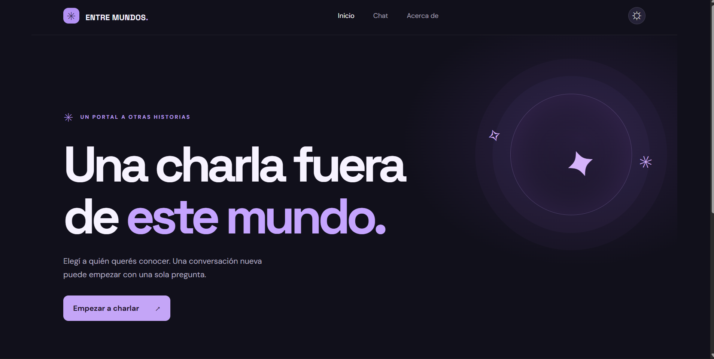
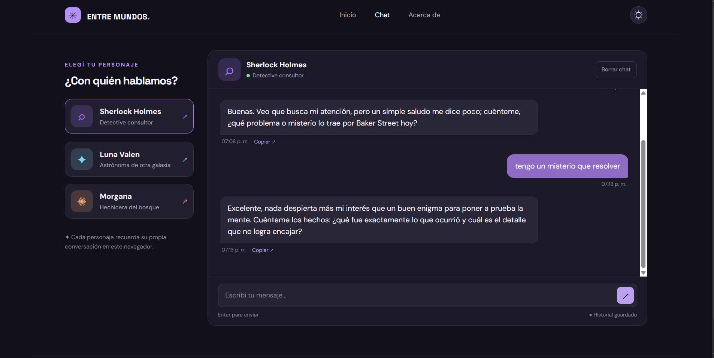

# Entre mundos

Aplicación web para conversar con personajes mediante Google Gemini. Permite elegir entre Sherlock Holmes, Luna Valen y Morgana. Tiene navegación entre Inicio, Chat y Acerca de, diseño adaptable a celular y computadora, e historial independiente para cada personaje.

## Personajes

- **Sherlock Holmes:** detective consultor observador, ingenioso y conciso.
- **Luna Valen:** astrónoma ficticia, cálida y curiosa; distingue la ciencia de la ficción.
- **Morgana:** hechicera del bosque con humor sutil; distingue la fantasía de los hechos reales.

Cada personaje tiene instrucciones de personalidad propias en `src/characters.js`.

## Aplicación publicada y repositorio

- **Aplicación:** https://entre-mundos-six.vercel.app
- **Repositorio:** https://github.com/DWMarcosSaucedo/entre-mundos

## Capturas de pantalla

### Inicio



### Chat funcionando



## Ejecutar localmente

Se necesita Node.js 20 o posterior, npm, una clave de Gemini obtenida en Google AI Studio y Vercel CLI.

1. Instalá las dependencias:

   ```bash
   npm ci
   ```

2. Instalá Vercel CLI si no la tenés:

   ```bash
   npm install -g vercel
   ```

3. Copiá `.env.example` como `.env.local`. En `.env.local`, reemplazá el valor de `GEMINI_API_KEY` por tu clave real. Ese archivo no se debe subir a GitHub.

4. Iniciá la aplicación:

   ```bash
   vercel dev
   ```

5. Abrí la dirección local que muestre la terminal. Para probar el chat necesitás ejecutar `vercel dev`, ya que la petición pasa por la función `api/chat.js`.

La clave de Gemini se usa únicamente en la función de Vercel y no se envía al código del navegador. El modelo configurado es `gemini-3.8-flash`.

## Tests

Para ejecutar las pruebas unitarias:

```bash
npm test
```

Se verificó la ejecución local de **5 tests con Vitest**: personajes y prompts, validación del historial, solicitudes inválidas, envío de contexto a Gemini sin exponer la clave y manejo de errores de la API.

## Desplegar en Vercel

1. Importá el repositorio de GitHub como un proyecto nuevo en Vercel.
2. Configurá `GEMINI_API_KEY` en **Settings → Environment Variables** para **Production**.
3. Desplegá la rama `main`. Si modificás una variable de entorno, creá un deployment nuevo para aplicar el cambio.
4. Visitá `/home`, `/chat` y `/about`, y enviá un mensaje en el chat para comprobar que responde Gemini.

`GEMINI_MODEL` es opcional. Si no se configura, la función utiliza `gemini-3.8-flash`.

## Funcionamiento

La navegación utiliza la History API, por lo que cambia de vista sin recargar la página y funcionan los botones de atrás y adelante. El historial se guarda en `localStorage` por personaje y puede eliminarse con «Borrar chat».

Al enviar un mensaje, `api/chat.js` valida la conversación, añade las instrucciones del personaje y consulta Gemini desde el servidor. La interfaz muestra el estado de escritura, los errores y las respuestas recibidas.

## Uso de IA durante el desarrollo

Utilicé ChatGPT como apoyo para crear la estructura inicial del proyecto, los estilos, la lógica del chat, la función de Vercel y las pruebas. Después configuré el repositorio y el despliegue, instalé las dependencias, ejecuté los tests y probé el chat publicado. Durante la puesta en marcha revisé los registros de Vercel y actualicé el modelo de Gemini al detectar que el anterior ya no estaba disponible para mi cuenta.